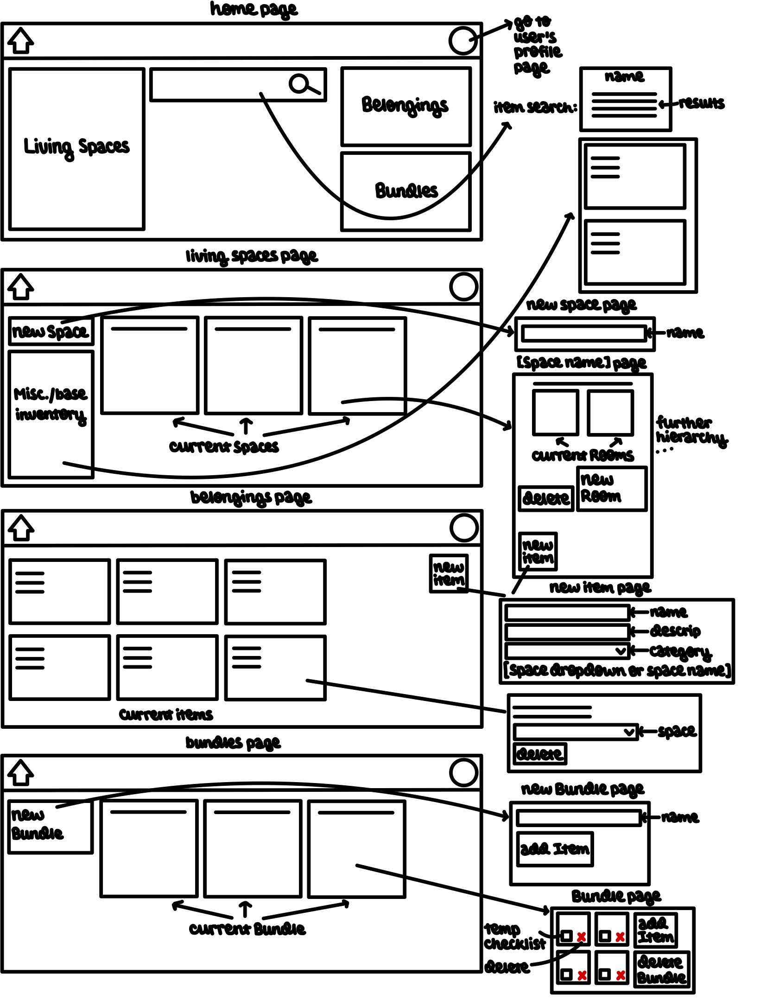

# Assignment 2

## Problem Statement 

### Problem Domain: Personal Item Management

The domain of personal item management centers around the constant challenge of keeping track of one's many belongings. The frustration of misplacing items is a significant, recurring, and universal inconvenience that disrupts routines and causes stress. This is a major challenge in my personal life as well--I'm frequently affected by the time wasted and anxiety induced by searching for misplaced items. I hope to find better, more intuitive solutions that can help individuals such as myself counter the draining effects of the time lost to searching and the stress induced by cognitive overload.

### Problem: Reliance on Memory or Disorganized Memory Tools

When people store an item, they usually rely on their memory or a random scribbled note to retrieve it. This is impractical for several reasons: brain capacity and memory span are limited, the circumstances in which the item was stored may be easily forgotten, and any notes can be confusing out of context. One's future self no longer has access to the thoughts of their past self through memories or simple notes, which means that the lack of an organized and visual system leads to a myriad of confusion down the line. 

### Stakeholders

1. People with Bad Memory: these are the main users who struggle to recall where they stored belongings. These stakeholders currently have quite a difficult time with the problem, and they would be positively affected if the problem were to be solved.
2. Family Members: these are the people who live with or frequently talk to People with Bad Memory. These stakeholders currently have to spend a lot of effort helping or comforting the People with Bad Memory when they can't find their belongings, and they would be positively affected if the problem were to be solved.
3. Location Tracker Manufacturers: these are the companies that make trackers such as AirTags that are meant to help people locate belongings. These stakeholders currently gain a lot from people who have the above problem, and they would be negatively affected if the problem were to be solved. 
   
### Evidence

1. ["Why Do I Constantly Lose All My Stuff?" (Vice)](https://www.vice.com/en/article/why-do-i-constantly-lose-all-my-stuff/): An article that states that losing stuff is a normal part of the human experience. It demonstrates that this is a common problem that causes a lot of stress and frustration for many people, so an app to address it could be helpful.
2. ["Find my stuff: Home Inventory App" (Google Play Store)](https://play.google.com/store/apps/details?id=com.miquelcms.homeorganizer&hl=en_US&pli=1): A description of a pre-existing app for organizing home belongings. While this is more organized than relying on one's memory or a random scribbled note, it could still lead to confusions without proper context or visual organization, so there's room for improvement. 
3. ["The Brain's Built-In GPS System" (Psychology today)](https://www.psychologytoday.com/us/blog/best-practices-in-health/202506/the-brains-built-in-gps-system#:~:text=The%20hippocampus%20creates%20mental%20maps,cues%20to%20form%20spatial%20maps.): An article that shows that creating mental maps (which is a good visualization tactic) can help with understanding and memory. This supports my claim that a more organized visual system could be helpful for this problem.
4. ["Overview of Data Visualization" (NIH)](https://pmc.ncbi.nlm.nih.gov/articles/PMC7303292/): An article about the importance of using visualizations to improve understanding. This supports the idea that having a visual system for logging belongings could be helpful to both engaging the user and enabling the user to find their objects more easily. 
5. ["Here's How AirTags Work" (Travel + Leisure)](https://www.travelandleisure.com/how-do-airtags-work-7377946): An article about the convenience of AirTags for tracking belongings. This is a potential type of competition for my attempt at solving the problems, but it's also expensive and impractical to get AirTags for everything so this isn't too big of an issue.

## Application Pitch

### Name: Findful

### Motivation

Findful transforms your chaotic belongings list into an interactive visualization of your personal space that makes keeping track of your possessions intuitive and easy. 

### Features

Findful helps users track their belongings through three main features. 

First, the **customizable interactive map** feature allows users to digitally recreate their living spaces as hierarchical trees of locations, from rooms down to specific drawers and shelves. By managing items within this structure, users build a visual inventory that provides clarity about where everything is stored.

Second, the **object lookup** feature allows users to instantly find items by name. The system also tracks the complete movement history for items, so that if an item isn't in its expected spot, likely alternative locations (based on past storage patterns) will be suggested.

Third, the **bundle creation** feature provides users with the ability to create custom checklists for any activity or occasion by building a bundle of items they may need for these specific events. Whether packing for vacation or grabbing gym gear, users can use the corresponding bundle to track the items they need, in order to ensure nothing is forgotten. 

## Concept Design

### Concept Specifications

#### Concept 1:

**concept** User

**purpose** uniquely identify and authenticate individuals for secure access to the application

**principle** each user registers with unique credentials (unique username and password) that authenticate their identity and authorize access to personal data and resources

**state**
* a set of Users with
  * a username String
  * a password String

**actions**
* registerUser(username: String, password: String): (user: User)
  * **requires:** username is not taken
  * **effects:** creates and returns new User with username String and password String
* authenticateUser(username: String, password: String)
  * **requires:** username exists, password matches username

#### Concept 2:

**concept** StorageHierarchy [User]

**purpose** represent a user's living space with support for a hierarchy of storage locations

**principle** a user can recreate their living space, defining a hierarchy of smaller spaces from rooms down to storage compartments. This structure allows items to be placed within this virtual space, mirroring their real-world locations. 

**state**
* a set of Spaces with
  * an owner User
  * a name String
  * a type SpaceType
  * a parent Space
  * a set of child Spaces (optional)

**actions**
* createSpace(user: User, name: String, type: SpaceType, parent: Space): (space: Space)
  * **requires:** User exists, name unique among parent's children
  * **effects:** creates and returns new Space with owner User, name String, type SpaceType, and parent Space
* moveSpace(space: Space, newParent: Space)
  * **requires:** Space and newParent exist
  * **effects:** changes Space's parent to newParent
* renameSpace(space: Space, name: String)
  * **requires:** Space exists, name unique among parent's children
  * **effects:** changes Space's name to name
* deleteSpace(space: Space)
  * **requires:** Space is empty
  * **effects:** deletes Space and all its children Spaces

#### Concept 3:

**concept** Item [User]

**purpose** comprehensive digital representation of users' individual belongings

**principle** users can create profiles for each of their owned items, with which they store information about the item such as descriptions of the item and categorization of its use(s)

**state**
* a set of Items with
  * an owner User
  * a name String
  * a description String (optional)
  * a category String (optional)

**actions**
* createItem(user: User, name: String, description: String?, category: String?): (item: Item)
  * **requires:** User exists
  * **effects:** creates and returns new Item belonging to User with name String and optional description and/or category
* deleteItem(item: Item)
  * **requires:** Item exists
  * **effects:** removes Item
* updateItemDetails(item: Item, name: String?, description: String?, category: String?)
  * **requires:** Item exists; at least one of name, description, and category exists
  * **effects:** updates Item's name, description, and/or category

#### Concept 4:

**concept** LocationLogging [Item, Location]

**purpose** track the current and past locations of items within the spatial storage hierarchy

**principle** users can create logs for items' physical journeys, which link an item to its current location and all of its past locations. The log corresponding to each item is updated each time the item is moved.

**state**
* a set of LocationLogs with
  * an Item
  * a current Location
  * a location History (sequence of Locations Item has been in, in reverse chronological order)

**actions**
* placeItem(item: Item, newLocation: Location)
  * **requires:** Item and Location exist
  * **effects:** updates current LocationLog for Item by adding current Location to the most recent end of location History and setting current Location to newLocation
* deleteLog(log: LocationLog)
  * **requires:** LocationLog exists
  * **effects:** removes LocationLog

#### Concept 5:

**concept** Bundle [User, Item]

**purpose** create and track logical groups of items based on shared usage contexts or activities, independent of their physical locations

**principle** users can organize items into purpose-based bundles that function as checklists for specific activities and occasions, independent of physical storage locations

**state**
* a set of Bundles with
  * an owner User
  * a name/purpose String
  * a set of Items

**actions**
* createBundle(user: User, name: String): (bundle: Bundle)
  * **requires:** User exists, name is unique to User
  * **effects:** creates and returns new Bundle with name String and belonging to User with no items
* deleteBundle(bundle: Bundle)
  * **requires:** Bundle exists
  * **effects:** removes Bundle from User's Bundles
* addItemToBundle(item: Item, bundle: Bundle)
  * **requires:** Item and Bundle exist and have the same owner
  * **effects:** adds Item to Bundle
* removeItemFromBundle(item: Item, bundle: Bundle)
  * **requires:** Item is in Bundle
  * **effects:** removes Item from Bundle

### Synchronizations

#### Sync 1:

**sync** storeItem

**when** Request.storeItem(User, Item, Location: Space)

**where** 
* Item name is associated with item from storeItem request
* Item description is associated with item from storeItem request
* Item category is associated with item from storeItem request

**then** 
* Item.createItem(user: User, name: Name, description: Description, category: Category)
* LocationLogging.placeItem(item: Item, newLocation: Location)

#### Sync 2:

**sync** discardItem

**when** Request.removeItem(Item)

**where** LocationLog is the log that has item Item

**then**
* Item.deleteItem(item: Item)
* LocationLog.deleteLog(LocationLog)
* for all Bundles containing Item, Bundle.removeItemFromBundle(Item, Bundle); if that makes that Bundle empty, then Bundle.deleteBundle(Bundle)

#### Sync 3:

**sync** removeSpace

**when** Request.removeSpace(space: Space)

**where** Space's parent is associated with space from removeSpace request

**then** 
* for all Items in Space and Space's children: LocationLogging.placeItem(item: Item, Space.parent) 
* Space.deleteSpace(Space)

### A brief note

Findful's concept design creates a secure and clear system for physical item management, where each concept plays a distinct and important role. 

**User** is the basic concept for direct stakeholders of the app, authenticating access to personal data. It controls access by requiring authentication before any access to personal resources can be granted. 

**Storage Hierarchy** creates the hierarchical spatial context for tracking items. Each storage tree is bound to its unique owner (generic type [User]) to control access. This concept transforms physical spaces into navigable digital entities (Spaves), from entire living spaces down to individual compartments.

**Item** represents the physical belongings being tracked.  Each Item is also bound to its unique owner, generic type [User]. Items exist independently of storage locations. 

**Location Logging** connects [Items] to [Storage Hierarchy] locations (when they have the same owner), thus forming the backbone of this application. This concept creates links between the items that users own and where those items are stored, while recording storage history for location prediction.

**Bundle** introduces organization based on usage contexts, with generic type [Users] being able to create bundles of [Items] for specific contexts. This concept allows users to group items for purposes other than physical location--a sheer contrast to the LocationLogging concept. 

Overall, the concepts create a cohesive organization system: User owns Storage Hierarchy Spaces and Items, which are linked by Location Tracking. Bundles serve as an alternative form of organization for Items. 

## UI Sketches

## User journey

A user keeps misplacing their belongings, and wants a better way to keep track of them, so they create an account on Findful and open up the app.

On the home page, they can click on the living spaces category to go to living spaces page, where they can access their current living spaces. There aren't any yet, so they make a new living space map by clicking on the "new living space" button on that page. They make a living space map for their current house, then add rooms corresponding to each of the rooms by clicking on the button in the living space map. Within each room, they can further subdivide into spaces such as furniture and compartments by clicking buttons on the page for the space they want to subdivide. 

When they are done with creating their location mapping, they can begin to add their belongings one by one. They can do so by clicking a button on the belongings page or within a storage location's page, which leads them to a form where they can enter item information (and pick a location if they're creating the item from the items page, otherwise the location is default). They can move the item by clicking on it and changing its location field. They can access all items on the belongings page.

To delete a space (for example, if they donate a cabinet), they click on the page for that space and there's a button to do so--all the items previously in that space are now in its parent space (note that the highest level parent space is the living spaces page/user's inventory, which cannot be deleted, and can be accessed from the living spaces page). If a living space is deleted, then all items within it automatically go to the highest level parent space (which can be thought of as a temporary storage pod, consisting of a simple list of items) until they're relocated. 

When the user forgets where they put an item, they go to the search bar on the home page and type in the item name, which returns a list of locations for the item, including where it currently is and its entire location history.

The user likes going to the gym a lot, but often forgets their water bottle or other gym gear. So, they decide to create a bundle by clicking on the "new bundle" button on the bundles page, where they can add items such as water bottle, gym shoes, and so on. The bundle provides a checklist that they can use every time before they go to the gym, and they can uncheck the boxes when they're done using it that time. There are also options to delete items from the bundles (using the red x's) if the items no longer belong in those bundles, or to delete the bundle altogether. 

With all this, the user is finally satisfied, and never loses belongings or forgets their gym gear ever again. 